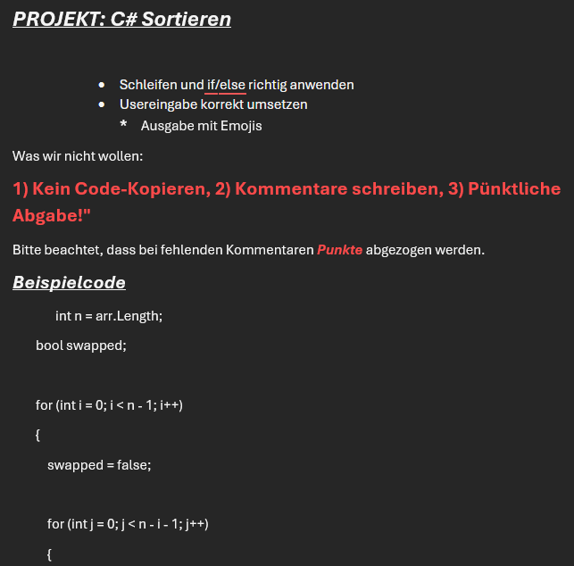
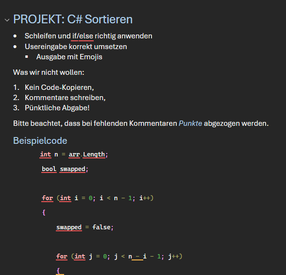

#### Welche Begriffe werden hier verwendet?
[`Markdown`](../../../05_Glossar.md#markdown), [`LaTeX`](../../../05_Glossar.md#latex), [`Inline`](../../../05_Glossar.md#inline), [`Code-Block`](../../../05_Glossar.md#code-block), [`HTML`](../../../05_Glossar.md#html), [`Parser`](../../../05_Glossar.md#parser), [`Renderer`](../../../05_Glossar.md#renderer), [`Linter`](../../../05_Glossar.md#linter), [`WYSIWYG`](../../../05_Glossar.md#wysiwyg), [`Auszeichnungssprache`](../../../05_Glossar.md#auszeichnungssprache), [`annotieren`](../../../05_Glossar.md#annotieren), [`Datenstruktur`](../../../05_Glossar.md#datenstruktur), [`Grammatik`](../../../05_Glossar.md#grammatik), [`Compiler`](../../../05_Glossar.md#compiler), [`Syntax`](../../../05_Glossar.md#syntax), [`Fehler`](../../../05_Glossar.md#fehler), [`Parsen`](../../../05_Glossar.md#parsen), [`kompilieren`](../../../05_Glossar.md#kompilieren), [`ausführen`](../../../05_Glossar.md#ausführen), [`Semantik`](../../../05_Glossar.md#semantik), [`Warnings`](../../../05_Glossar.md#warnings), [`css`](../../../05_Glossar.md#css), [`markdown-code`](../../../05_Glossar.md#markdown-code), [`Schema`](../../../05_Glossar.md#schema), [`statische Analyse`](../../../05_Glossar.md#statische-analyse), [`Bugs`](../../../05_Glossar.md#bugs), [`Punkte`](../../../05_Glossar.md#punkte), [`Darstellung`](../../../05_Glossar.md#darstellung), [`Absätze`](../../../05_Glossar.md#absatz), [`Paragraph`](../../../05_Glossar.md#paragraph), [`Blockzitate`](../../../05_Glossar.md#blockzitate), [`Tabellen`](../../../05_Glossar.md#tabellen).

## Was sind Auszeichnungssprachen?

Für *Mitschriften*, *Zettelübungen* und *Protokolle* der *Mini-Projekte*, nutzen wir eine `Auszeichnungssprache` namens [*markdown (click me)*](https://www.markdownguide.org/basic-syntax/). Anstatt wie in *MS Word* auf Buttons für **Fett** oder 
###### Überschrift
zu klicken, `annotieren` wir mithilfe von *unüblichen* Symbolen direkt den Text. Dieses Dokument selbst ist ein *Markdown* File und wird von einem sogenannten `Parser` in eine `Datenstruktur` umgewandelt, die `Grammatik` überprüft und anschließend mit dem `Renderer` *grafisch* aufbereitet (*CTRL+SHIFT+v* in *VS Code*). Damit das funktioniert, muss der `Parser` zuerst verstehen, was wir geschrieben haben.

> **Kurzer Ausflug ins Programmieren:**  Beim *Programmieren* erinnert uns das an den `Compiler`, welcher *strengstens* jedes geschriebene Symbol `syntaktisch` analysiert und bei einem Fehlverhalten uns mit einem `Fehler` konfrontiert. `Parsen` ist hier ein Teilschritt des `kompilierens`. Wenn kein `syntaktischer` Fehler mehr vorkommt, erlaubt uns dieser, das Programm zu `kompilieren` und `auszuführen`. Zusätzlich zur `syntaktischen` Überprüfung werden auch *schwache* `semantische` Empfehlungen als `Warnings` hinzugefügt. Wenn z.B. wir einen Coding-Standard verletzen, logische Widersprüche haben *while(true && !true){...}*, oder wir vergessen, gewisse Methoden aufzurufen um eine Verbindung zu einem Server zu trennen.

Unser `Parser` ist jedoch nicht wie beim Programmieren mit *C#* oder *JAVA* so streng. Wenn wir Fehler machen, wird uns **nicht** gesagt, dass hier etwas falsch ist, es wird einfach dem `Renderer` übergeben, welcher dann nicht **genau** das tut, was wir ihm versuchen zu sagen. Das erlaubt uns ein flexibleres Verhalten, denn es könnte ja schon irgendwie funktionieren, aber es fördert *gedankenloses Ausprobieren* im besten Fall und *versteckte Fehler* im schlimmsten Fall. 

Warum sprechen wir hier über markdown, wenn wir eigentlich über `html` und `css` sprechen sollen?
Der Grund ist, dass `html` selbst eine `Auszeichnungssprache` ist und wir dadurch in jedem Schritt dieses Kurses eine solche verwenden. Im einen Fall für unsere Mitschriften und im anderen Fall, um strukturiert Informationen über das Web zu schicken.

> **Wir merken uns:**
> 1. `Auszeichnungssprachen` ``annotieren`` Text mit Symbolen an, um *Struktur* zu definieren.
> 2. Der ``Parser`` liest die Symbole und baut eine ``Datenstruktur``. Der ``Renderer`` erzeugt daraus die *Darstellung*.

### Was ist ein Linter?

Ein ``Linter`` ist ein Hilfsprogramm, das uns beim Schreiben von Code oder ``Auszeichnungssprachen`` über die Schulter schaut. Während ein Markdown-``Parser`` sehr fehlerverzeihend ist und aus schlechtem Code ein "irgendwie funktionierendes" Dokument baut, beschwert sich der Linter sofort, wenn wir unsauber arbeiten. Er zwingt uns dazu, uns an *formale Standards* zu halten (z.B. keine überflüssigen Leerzeilen, konsistente Aufzählungszeichen).

Damit wir feedback bekommen über unsre geschriebenen *markdown* Files welche wir in Zukunft schreiben, installieren wir in *VS Code* die Erweiterung **markdownlint**. Sie unterstreicht unsaubere Stellen gelb, genau wie die Rechtschreibprüfung in Word.

Wir haben nun mehrere *Begriffe* die sehr ähnlich klingen. Unterschiden wir diese.
|  | Aufgabe | Ziel |
| :--- | :--- | :--- |
| ``Compiler`` | Übersetzt geschriebenen Quellcode einer Programmiersprache vollständig in ausführbaren Maschinen- oder Zwischencode. | Ein ``Parser`` ist ein Teilschritt. Kümmert sich um Übesetzung, Ausführbarkeit und strikte Einhaltung der ``Syntax``. |
| ``Schema`` | Ist ein Bauplan und die Regeln für die Struktur von Daten. | Prüft ``Semantik``. |
| ``Linter`` |  Analysiert Stilfehler, unsaubere Formatierungen und potenzielle Bugs, ohne diesen auszuführen ``statische Analyse``. Verbessert Code-Qualität, Lesbarkeit, Konsistenz und Einhaltung von Standards.| Prüft``Semantik` |
| ``Parser`` | Zerlegt Text zeichenweise in eine ``Datenstruktur``. Dadurch wird die ``Grammatik`` geprüft | ``syntaktische`` Prüfung |
| ``Renderer`` | Nimmt die ``Datenstruktur`` des `` Parsers`` und berechnet die grafische Darstellung. | Layout, Darstellung, Optik. |

> **Wir merken uns:**
> 3. Ein `Compiler` übersetzt Code und ist für die ``Syntax`` zuständig.
> 4. Ein `Schema` definiert den strengen Bauplan und die ``Semantik`` von Text *"Das ist ein gültiges Datum"*.
> 5. Ein `Linter` überprüft Text auf *schwache* `semantische` Regeln. Er erzwingt Konsistenz und macht auf potentielle `Bugs` aufmerksam.
> 6. Der `Parser` zerlegt Text in eine ``Datenstruktur``, und der `Renderer` macht erzeugt daraus eine Darstellung dieser ``Datenstruktur``.

### Warum sollte ich Markdown verwenden? 

Wenn es Textverarbeitungsprogramme wie Microsoft Word gibt, warum schreiben wir dann *Dokumentationen*, *Notizen* oder *Mitschriften* mit ``Annotationen`` in reine Textdateien?

* **"What You See Is What You Get" (WYSIWYG) vs. reine Struktur:** 
  Word ist ein WYSIWYG-Editor. Du formatierst einen Text und er sieht am Bildschirm sofort so aus, wie er später gedruckt wird. Das ist intuitiv, vermischt aber Inhalt und Design untrennbar miteinander. Wenn du das Design später ändern willst, klickst du dich mühsam durch hunderte Seiten.
* **Der Fokus auf den Inhalt:**
  In Markdown (und seinem mächtigeren, akademischen Verwandten **LaTeX**) schreibst du nur die reine Struktur auf ("Das hier ist eine Überschrift"). Wie diese Überschrift später aussieht (Schriftart, Farbe, Abstand), entscheidet erst der Renderer ganz am Schluss. Du fokussierst dich zu 100 % auf das Schreiben, nicht auf das Layouten.
* **Automatisierung und Maschinenlesbarkeit:**
  Eine Word-Datei (*.docx*) ist für einen Computer schwer automatisiert zu verarbeiten. Eine Markdown-Datei (*.md*) ist reiner Text. Wir können ihn mit kleinen Skripten durchsuchen, ihn auf GitHub anzeigen lassen, ihn automatisch in PDF-Zettelübungen umwandeln oder ihn als Eingabe für künstliche Intelligenz nutzen.
* **Die Verwandtschaft zu LaTeX:**
  LaTeX ist der große Bruder von Markdown. Während Markdown für schnelle, einfache Notizen im Web gedacht ist, ist LaTeX das absolute Standardwerkzeug für komplexe Buchlayouts, Bachelorarbeiten oder physikalische Skripten. Beide verfolgen dasselbe Prinzip: Wir schreiben nur Struktur, das Programm übernimmt das perfekte Setzen des Layouts.

> **Wir merken uns:**
> 7. ``WYSIWYG`` mischt Inhalt und Design visuell. Das ist intuitiv, aber schwer zu automatisieren.
> 8. ``Markdown & LaTeX`` trennen *Struktur* und *Design* strikt. Diese Trennung erlaubt uns Änderungen im *Design* vorzunehmen ohne die *Strutkur* ändern zu müssen. Umgekehrt ebenso.

### Wie verwenden wir Markdown?

Was stört uns im linken Bild? Die Struktur fehlt. Die Überschrift ist nur großer Text, die Liste wurde mit Leerzeichen simuliert. Rechts sieht es optisch ähnlich aus, aber strukturell ist es korrekt mit Formatvorlagen aufgebaut.

| Not Ok? (Link zu [Word](BeispieleWord/NegativBeispiel.docx) oder [pdf](BeispieleWord/NegativBeispiel.pdf)) | Ok? (Link zu [Word](BeispieleWord/BessereUmsatzungBeispiel.docx) oder [pdf](BeispieleWord/BessereUmsatzungBeispiel.pdf)) |
| :---: | :---: |
|  |  |

Wir lösen es nun in markdown. Zuerst der `markdown-code` welchen wir mit dem `LINTER` *lintmarkdown* überprüfen.

```markdown
# PROJEKT: C# Sortieren

### 🎯 Anforderungen

* **Schleifen und if/else** richtig anwenden
* **Usereingabe** korrekt umsetzen
* **Ausgabe** mit Emojis gestalten

### ⚠️ Was wir nicht wollen / Beachten

1. ❌ **Kein Code-Kopieren**
2. 📝 **Kommentare schreiben!** 
3. ⏰ **Pünktliche Abgabe!**

Bitte beachtet, dass bei fehlenden Kommentaren `Punkte` abgezogen werden

### 💻 Beispielcode

```csharp
int n = arr.Length;  
bool swapped;  
   
for (int i = 0; i < n - 1; i++)  
{  
    swapped = false;  
   
    for (int j = 0; j < n - i - 1; j++)  
    {  
        // Vergleiche benachbarte Elemente  
        if (arr[j] > arr[j + 1])  
        {  
            // Tausche sie, wenn sie in der falschen Reihenfolge sind  
            int temp = arr[j];  
            arr[j] = arr[j + 1];  
            arr[j + 1] = temp;  
              
            swapped = true;  
        }  
    }  
   
    // Wenn keine Elemente getauscht wurden, ist das Array bereits sortiert  
    if (!swapped)  
    {  
        break;  
    }  
} 
```
```

Und nun das Dokument nach dem `rendern`.

---

# PROJEKT: C# Sortieren

### 🎯 Anforderungen

* **Schleifen und if/else** richtig anwenden
* **Usereingabe** korrekt umsetzen
* **Ausgabe** mit Emojis gestalten

### ⚠️ Was wir nicht wollen / Beachten

1. ❌ **Kein Code-Kopieren**
2. 📝 **Kommentare schreiben!** 
3. ⏰ **Pünktliche Abgabe!**

Bitte beachtet, dass bei fehlenden Kommentaren `Punkte` abgezogen werden

### 💻 Beispielcode

```csharp
int n = arr.Length;  
bool swapped;  
   
for (int i = 0; i < n - 1; i++)  
{  
    swapped = false;  
   
    for (int j = 0; j < n - i - 1; j++)  
    {  
        // Vergleiche benachbarte Elemente  
        if (arr[j] > arr[j + 1])  
        {  
            // Tausche sie, wenn sie in der falschen Reihenfolge sind  
            int temp = arr[j];  
            arr[j] = arr[j + 1];  
            arr[j + 1] = temp;  
              
            swapped = true;  
        }  
    }  
   
    // Wenn keine Elemente getauscht wurden, ist das Array bereits sortiert  
    if (!swapped)  
    {  
        break;  
    }  
}  
```
</br>

> **Wir merken uns:**
> 9. Wir schreiben den `Markdown-Code` als ersten Schritt und betrachten die fertige ``Darstellung`` nach dem `Rendern`.

#### Auflistung der zu besprechenden Elemente

##### 1) Überschriften

Überschriften werden mit einer Raute *#* erzeugt. Je mehr Rauten, desto kleiner die Überschrift.

```markdown
# Hauptüberschrift (H1)
## Unterkapitel (H2)
### Unter-Unterkapitel (H3)

Das ist ein normaler Text. Um etwas zu betonen, können wir es **fett** oder *kursiv* schreiben. Wir können Text auch ~~durchstreichen~~.
```

> **Wir merken uns:**
> 10. *Überschriften* werden durch Rauten *#* am Zeilenanfang definiert. Die Anzahl der Rauten bestimmt die Hierarchie-Ebene der Überschriften.
> 11. *Kursiver* und **fetter** Text wird mit einem Sternpaar ** bzw. zwei Sternpaaren **** beschrieben und kann *kombiniert* Werden. 
> 12. *Kursiver* und **fetter** Text dient zum ***hervorheben*** von Text, nicht um Überschriften zu erstellen.

##### 2. Listen

Listen sind in Markdown *geordnet* oder *ungeordnet*.

```markdown
Ungeordnete Liste (Punkte):
* Erster Punkt
* Zweiter Punkt
  * Eingerückter Unterpunkt (mit Leerzeichen davor)

Geordnete Liste (Zahlen):
1. Erster Schritt
2. Zweiter Schritt
```

> **Wir merken uns:**
> 13. ``Ungeordnete Listen`` nutzen _*_ oder *-*. **Geordnete Listen** nutzen Zahlen wie *1.*. Einrückungen mit dem Tabulator erzeugen Unterpunkte.

##### 3. Links und Bilder

Die Syntax für Links und Bilder ist fast identisch. Bilder haben lediglich ein Ausrufezeichen *!* ganz am Anfang.

```markdown
Ein Link:
[Hier steht der klickbare Text](https://www.htl.at)

Ein Bild (z.B. aus demselben Ordner):

```

> **Wir merken uns:**
> 14. ``Links`` folgen der ``Syntax`` `[Text](URL)`. **Bilder** nutzen exakt dieselbe ``Syntax``, haben aber ein Ausrufezeichen vorangestellt: ``.

##### 4. Code darstellen

Da wir Entwickler sind, müssen wir oft Code-Beispiele teilen. 
*   **`Inline`-Code:** Kurzer Code mitten im Satz wird mit einem einzelnen Backtick (Gravis) umschlossen.
*   **`Code-Block`:** Mehrere Zeilen Code werden normalerweise mit drei Backticks umschlossen. Wenn wir direkt danach die Sprache (z.B. `html` oder `csharp`) dazuschreiben, färbt Markdown den Code sogar farbig (Syntax Highlighting) ein!

```markdown
Hier ist ein C# Block:
```csharp
int alter = 15;
Console.WriteLine(alter);
```
```

Wird zu 
```csharp
int alter = 15;
Console.WriteLine(alter);
```

> **Wir merken uns:**
> 15. Ein Backtick (*``*) fasst **Inline-Code** ein. Drei Backticks (*```*) gefolgt vom Sprachnamen erzeugen mehrzeilige **Code-Blöcke** mit Syntax-Highlighting.
> 16. **Inline-Code** kann für das *Hervorheben* von Texten verwendet werden.

##### 5. Zeilenumbrüche erzwingen

In Markdown erzeugt ein einfaches "Enter" (neue Zeile) im Code **keinen** echten Zeilenumbruch im gerenderten Text. Der Parser fügt den Satz einfach an den vorherigen an. 

Um einen harten Zeilenumbruch (wie `<br>` in HTML) zu erzwingen, gibt es mehrere Möglichkeiten:

1. **Der Backslash `\`:** In vielen modernen Parsern reicht ein einzelner Backslash `\` am Ende der Zeile. **Achtung:** Das funktioniert nicht bei allen Renderern! Manche alte Parser können damit nichts anfangen und zeigen den Backslash dann einfach als Text an.
2. **HTML-Tag:** Wenn alles andere scheitert, kannst du immer noch manuell `<br>` ans Ende tippen.

> **Wir merken uns:**
> 17. Ein line break kann falls zwei mal Enter nicht funktioniert mit einem Backslash `\` oder dem HTML-Tag `<br>` umgesetzt werden.

##### 6. HTML und LaTeX in Markdown einbauen

Markdown deckt etwa 90 % unserer Bedürfnisse ab. Wenn wir aber spezielle Dinge brauchen (wie eine komplexe Tabelle, exakte Bildgrößen oder mathematische Formeln), greifen wir auf zwei mächtige Werkzeuge zurück:

###### HTML in Markdown
Markdown ist voll kompatibel mit HTML! Wenn du etwas in Markdown nicht hinbekommst, kannst du jederzeit HTML-Tags in dein `.md`-Dokument schreiben.

```markdown
Ich möchte <span style="color: red;">genau diesen Text in Rot</span> haben!

Ein Bild, das exakt 100 Pixel breit ist (geht mit Markdown allein nicht gut):

```

Wird zu 

>Ich möchte <span style="color: red;">genau diesen Text in Rot</span> haben!

Ein Bild, das exakt 100 Pixel breit ist (geht mit Markdown nicht):


###### Mathematik mit LaTeX
Für komplexe mathematische Formeln nutzt Markdown die Wissenschaftssprache **`LaTeX`**. Wir signalisieren Markdown mit Dollarzeichen `$`, dass nun eine Mathe-Formel folgt. 

*Ein spezieller LaTeX-Trick:* Wenn du innerhalb eines LaTeX-Blocks einen Zeilenumbruch erzwingen willst, nutzt du einen doppelten Backslash: `\\`. Das sagt dem LaTeX-Renderer "Hier ist die Zeile zu Ende". Oft muss man das in Markdown-Blöcken sogar als `$\\$` schreiben, damit der Markdown-Parser die Backslashes nicht vorher wegschluckt.

```markdown
Dies ist eine **Inline**-Formel direkt im Text: $E=mc^2$.

Dies ist ein großer, zentrierter **Code-Block** für Formeln (zwei Dollarzeichen):
$$
x_{1,2} = \frac{-b \pm \sqrt{b^2 - 4ac}}{2a}
$$
```
$\\$
Wird zu 

$$x_{1,2} = \frac{-b \pm \sqrt{b^2 - 4ac}}{2a}$$  

>**Wir merken uns:** 
> 18. Für komplexe ``Annotationen`` greifen wir auf **HTML-Tags** zurück. 
> 19. Komplexe mathematische Formeln binden wir mit der ``Auszeichnungssprache`` **LaTeX** direkt in Markdown ein (`$` oder `$$`).

##### 7. Absätze, Zitate und Tabellen

**Absätze** entstehen in Markdown ganz natürlich, indem  eine komplette Leerzeile zwischen zwei Textblöcken lässt. Ohne diese Leerzeile klebt der Renderer die Sätze einfach aneinander.

**Blockzitate** (Blockquotes) werden genutzt, um Text besonders hervorzuheben, zu zitieren oder Notizen optisch abzugrenzen. Du erzeugst sie mit einem `>` am Zeilenanfang. Sie lassen sich auch wunderbar verschachteln, indem du einfach mehrere `>` hintereinander schreibst.

**Tabellen** baust du mit senkrechten Strichen (`|`, oft *Pipes* genannt) für die Spalten und Bindestrichen (`-`) unter der Kopfzeile. Mit Doppelpunkten (`:`) in dieser Trennzeile steuerst du sogar, ob der Text links, rechts oder zentriert ausgerichtet wird.

```markdown
Das ist der erste Absatz.

Das ist der zweite Absatz. Er steht nach einer leeren Zeile.

> Das ist ein einfaches Zitat oder eine Hervorhebung.
> > Das ist ein verschachteltes Zitat, das noch weiter eingerückt ist.
> 
> Hier sind wir wieder auf der ersten Zitatebene.

| Element | Kürzel | Semantische Bedeutung |
| :--- | :---: | ---: |
| Absatz | `<p>` | Fließtext |
| Zitat | `<blockquote>` | Hervorhebung |
| Tabelle | `<table>` | Strukturierte Daten |
```
</br>
Welches dann so aussieht
Das ist der erste Absatz.

Das ist der zweite Absatz. Er steht nach einer leeren Zeile.

> Das ist ein einfaches Zitat oder eine Hervorhebung.
> > Das ist ein verschachteltes Zitat, das noch weiter eingerückt ist.
> 
> Hier sind wir wieder auf der ersten Zitatebene.

| Element | Kürzel | Semantische Bedeutung |
| :--- | :---: | ---: |
| Absatz | `<p>` | Fließtext |
| Zitat | `<blockquote>` | Hervorhebung |
| Tabelle | `<table>` | Strukturierte Daten |

> **Wir merken uns:**
> 20. ``Absätze`` (``Paragraph``) benötigen zwingend eine echte Leerzeile im Markdown-Code.
> 21. ``Blockzitate`` werden mit einem `>` eingeleitet und können für tiefere Ebenen (`>>`) verschachtelt werden.
> 22. ``Tabellen`` werden visuell mit `|` (Spalten) und `-` (Kopfzeilen-Trennung) gezeichnet. Doppelpunkte `:` bestimmen die Textausrichtung.