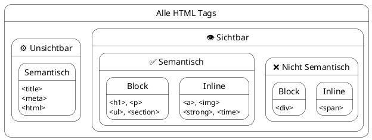

#### Welche Begriffe werden hier verwendet?
[``Client``](../../../05_Glossar.md#client), [``Server``](../../../05_Glossar.md#server), [``Statische Website``](../../../05_Glossar.md#statische-website), [``Dynamische Website``](../../../05_Glossar.md#dynamische-website), [``Single Page Application (SPA)``](../../../05_Glossar.md#spa), [``Web-API``](../../../05_Glossar.md#web-api), [``HTTP``](../../../05_Glossar.md#http), [``RESTful``](../../../05_Glossar.md#restful), [``HTML5``](../../../05_Glossar.md#html5), [``Tag``](../../../05_Glossar.md#tag), [``Start-Tag``](../../../05_Glossar.md#start-tag), [``Closing Tag``](../../../05_Glossar.md#closing-tag), [``Non-Closing Tag``](../../../05_Glossar.md#non-closing-tag), [``Attribut``](../../../05_Glossar.md#attribut), [``Semantik``](../../../05_Glossar.md#semantik), [``Semantische Tags``](../../../05_Glossar.md#semantische-tags), [``Nicht-semantische Tags``](../../../05_Glossar.md#nicht-semantische-tags), [``Blindtext``](../../../05_Glossar.md#blindtext).

# Client vs. Server

## 1. Wie das Web funktioniert: Client und Server

Bevor wir Code schreiben, müssen wir verstehen, wie Webseiten überhaupt auf unseren Bildschirm kommen. Das Internet basiert auf dem **Client-Server-Modell**.
*   Der **``Client``** ist der Bittsteller. In unserem Fall ist das der Webbrowser (Chrome, Firefox, Safari) auf deinem Laptop oder Smartphone.
*   Der **``Server``** ist ein leistungsstarker Computer im Internet, der Tag und Nacht läuft. Dort liegen die Dateien der Website.

Der Client sendet einen *Request* (eine Anfrage, z.B. die Eingabe einer URL) an den Server. Der Server verarbeitet diese Anfrage und schickt eine *Response* (eine Antwort, z.B. HTML-, CSS- und Bild-Dateien) zurück, die der Browser dann grafisch darstellt.

### Arten von Websites und wann man sie verwendet
Je nachdem, *wie* der Server diese Antwort zusammenstellt, unterscheiden wir verschiedene Architektur-Arten:

1.  **``Statische Websites``:** Die HTML-, CSS- und Bild-Dateien liegen exakt so auf dem Server, wie sie geschrieben wurden. Der Server nimmt die Datei und schickt sie unverändert an den Client. 
    *   *Wann verwenden?* Für Portfolios, reine Informationsseiten (wie Firmen-Visitenkarten), Dokumentationen oder Landingpages. Sie sind extrem schnell, sicher und günstig im Hosting.
2.  **``Dynamische Websites`` (Server-Side Rendered):** Die Webseite existiert nicht als fertige HTML-Datei. Stattdessen nutzt der Server eine Programmiersprache (wie PHP oder C#), um die HTML-Seite im Bruchteil einer Sekunde aus einer Datenbank neu zusammenzubauen, sobald ein User sie anfragt.
    *   *Wann verwenden?* Für Blogs, klassische Online-Shops (wie Amazon) oder Nachrichtenseiten. Also überall dort, wo sich Inhalte ständig ändern und SEO (Suchmaschinenoptimierung) sehr wichtig ist.
3.  **``Single Page Applications (SPA)`` & ``Web-APIs``:** Der Server schickt anfangs nur eine einzige, fast leere HTML-Datei an den Browser. Ein riesiges JavaScript-Programm (z.B. Angular, React oder Vue) übernimmt dann im Browser die Kontrolle. Wenn neue Daten gebraucht werden, fragt das JavaScript im Hintergrund bei einer **``Web-API``** nach reinen Textdaten (JSON) und baut die Webseite direkt im Browser (*Client-Side*) um. 
    *   *Wann verwenden?* Für hochinteraktive Web-Apps, Dashboards oder Soziale Netzwerke (wie Instagram, Netflix, Google Maps), die sich anfühlen sollen wie eine echte Smartphone- oder Desktop-App (ohne sichtbares Neuladen der Seite).

> **Wir merken uns:** 
> 1) Der **``Client``** (Browser) fragt Daten an, der **``Server``** liefert sie aus.
> 2) **Statische Websites** (unser Fokus) sind schnell und ideal für unveränderliche Infoseiten. 
> 3) **SPAs** laden die Seite nicht neu; die Logik liegt im Browser, der nur noch Rohdaten über eine **``Web-API``** anfordert.

---

## 2. Die Sprache des Internets: HTTP und RESTful

Damit der Client und der Server sich überhaupt verstehen, müssen sie dieselbe "Sprache" sprechen. Diese Sprache heißt **``HTTP``** (Hypertext Transfer Protocol).

Ein HTTP-Request (die Anfrage des Clients) enthält immer eine Methode, die beschreibt, *was* der Client tun möchte:
*   **GET:** "Gib mir Daten!" (z.B. Lade die Seite `index.html` herunter).
*   **POST:** "Hier sind neue Daten, speichere sie!" (z.B. Ein Kontaktformular absenden).

Der Server antwortet mit einem **HTTP-Statuscode**, der sagt, ob alles geklappt hat:
*   `200 OK`: Alles super, hier ist die Antwort.
*   `404 Not Found`: Die angefragte Seite existiert nicht.

### Was bedeutet RESTful?
Wenn wir (wie bei einer SPA) eine **``Web-API``** programmieren, halten wir uns heute meist an das **``RESTful``**-Prinzip. 
RESTful ist ein Design-Standard für APIs. Er besagt, dass wir die HTTP-Methoden logisch und vorhersehbar nutzen sollen, um Daten (Ressourcen) zu verwalten. 

Stell dir vor, unsere API verwaltet "Schüler":
*   `GET /schueler` -> Liefert eine Liste aller Schüler.
*   `POST /schueler` -> Legt einen neuen Schüler an.
*   `PUT /schueler/5` -> Aktualisiert den Schüler mit der ID 5.
*   `DELETE /schueler/5` -> Löscht den Schüler mit der ID 5.

> **Wir merken uns:** 
> 4) **``HTTP``** ist das Protokoll (die Sprache), mit dem Client und Server kommunizieren.
> 5) **``RESTful``** ist eine Architektur-Konvention für Web-APIs. Sie schreibt vor, die HTTP-Methoden (GET, POST, PUT, DELETE) logisch für Datenbank-Aktionen zu nutzen.

---

## 3. Die HTML-Syntax und das Grundgerüst

HTML (**H**yper**t**ext **M**arkup **L**anguage) ist das Fundament des Internets. Es ist keine Programmiersprache mit Variablen oder Schleifen, sondern eine **Auszeichnungssprache**.

HTML besteht aus sogenannten **``Tags``** (Markierungen). Ein Element besteht meist aus einem Start-Tag, dem Inhalt und einem End-Tag.
*   **Start-Tag:** `<p>`
*   **End-Tag:** `</p>` (mit Schrägstrich)

Start-Tags können **``Attribute``** enthalten. Sie liefern dem Browser Zusatzinformationen. Ein Link-Tag `<a>` braucht z.B. das Attribut `href`, um das Ziel zu definieren:
```html
<a href="https://www.w3schools.com">Besuche W3Schools</a>
```

> **Wir merken uns:** 
> 6) HTML wird verwendet, um dem Browser mitzuteilen, wie ein Text inhaltlich strukturiert ist.
> 7) **``Tags``** werden in spitzen Klammern geschrieben. Das End-Tag erhält einen Slash `/`.
> 8) **``Attribute``** stehen immer im Start-Tag und bestehen aus einem Namen und einem Wert in Anführungszeichen.

---

## 4. Semantik – Bedeutung vor Aussehen

In modernem Webdesign (HTML5) trennen wir strikt zwischen **Bedeutung (HTML)** und **Aussehen (CSS)**. 
**``Semantisches HTML``** bedeutet, dass wir Tags verwenden, die beschreiben, *was* der Inhalt ist, und nicht, wie er aussehen soll.

Wenn ein Wort kursiv gedruckt werden soll, dachte man früher sofort an das `<i>`-Tag (für *italic*). Heute nutzen wir stattdessen **`<em>` (für *emphasis* / Betonung)**.
*   Das `<i>`-Tag ist **nicht semantisch**. Es sagt dem Browser nur: "Stell das schräg dar."
*   Das `<em>`-Tag ist **semantisch**. Es verleiht dem Wort inhaltliches Gewicht. 

**Warum ist das wichtig?**
*   **Suchmaschinen (SEO):** Google wertet semantische Tags wie `<h1>` oder `<strong>` stärker, um zu verstehen, worum es auf der Seite geht.
*   **Barrierefreiheit:** Screenreader (Vorleseprogramme für Blinde) erkennen das `<em>`-Tag und verändern die Betonung der Computerstimme. Ein `<i>`-Tag würde ignoriert werden.

> **Wir merken uns:** 
> 9) Wir nutzen HTML **nur für die Struktur und Bedeutung**, niemals für das Design. Das Design übernimmt später CSS.
> 10) **``Semantische Tags``** verbessern die Auffindbarkeit bei Google und helfen Menschen, die auf Screenreader angewiesen sind.

---

## 5. Die wichtigsten HTML-Tags im Überblick

Hier ist eine Übersicht der Tags, die wir am häufigsten verwenden werden. Achte besonders auf die Spalte "Semantisch?".

| Tag | Name / Bedeutung | Einsatzzweck | Semantisch? |
| :--- | :--- | :--- | :--- |
| `<h1>` - `<h6>` | Headings | Überschriften. `<h1>` ist die Hauptüberschrift (nur 1x pro Seite!), `<h6>` die kleinste. | **Ja** |
| `<p>` | Paragraph | Ein ganz normaler Textabsatz. | **Ja** |
| `<em>` | Emphasis | Inhaltliche Betonung eines Wortes (wird standardmäßig *kursiv* dargestellt). | **Ja** |
| `<strong>` | Strong | Starke Wichtigkeit (wird standardmäßig **fett** dargestellt). | **Ja** |
| `<a>` | Anchor | Ein Hyperlink zu einer anderen Seite. Braucht das Attribut `href`. | **Ja** |
| `<ul>` & `<ol>` | Unordered / Ordered List | Eine ungeordnete (Punkte) oder geordnete (Zahlen) Liste. | **Ja** |
| `<li>` | List Item | Ein einzelner Listenpunkt. Muss immer innerhalb von `<ul>` oder `<ol>` stehen. | **Ja** |
| `` | Image | Bindet ein Bild ein. Braucht die Attribute `src` (Quelle) und `alt` (Alternativtext für Blinde). | **Ja** |
| `<div>` | Division | Ein generischer Container, um mehrere Elemente für CSS zu gruppieren (z.B. eine Box). | Nein |
| `<span>` | Span | Ein generischer Inline-Container, um z.B. ein einzelnes Wort für CSS zu markieren. | Nein |
| `<header>` | Header | Kopfbereich der Seite (Logo, Titel). | **Ja** |
| `<nav>` | Navigation | Bereich für das Hauptmenü. | **Ja** |
| `<main>` | Main | Der einzigartige Hauptinhalt der Webseite. | **Ja** |
| `<article>` | Article | Ein in sich geschlossener, unabhängiger Text (z.B. ein Blogpost). | **Ja** |
| `<footer>` | Footer | Fußzeile der Webseite (Copyright, Impressum). | **Ja** |

>**Anmerkung:** In ``VS Code`` können wir mit *!* und *!!!* die `` Tags`` generieren.

> **Wir merken uns:**
> 11) Vermeide die "Div-Suppe" (zu viele bedeutungslose `<div>`-Tags). Nutze stattdessen Zonen-Tags wie `<main>`, `<article>` oder `<nav>`, wo immer es möglich ist.
> 12) **``Semantische Tags``** geben dem Browser und Suchmaschinen die exakte Bedeutung des Inhalts vor. Beispiele: `<h1>` bis `<h6>`, `<p>`, `<strong>`, `<em>`, `<a>`, `<ul>`, `<ol>`, `<li>`, `<header>`, `<nav>`, `<main>`, `<article>`, `<aside>`, `<footer>`.
> 13) **``Nicht-semantische Tags``** verraten nichts über ihren Inhalt und dienen lediglich als neutrale Container für das spätere CSS-Design. Beispiele: `<div>` (für Block-Elemente) und `<span>` (für Textabschnitte).

---

### Closing und Non-Closing Tags (Leere Elemente)
Die meisten HTML-Tags treten als Paar auf: Es gibt ein **``Start-Tag``** und ein **``Closing Tag``** (End-Tag mit Schrägstrich, z.B. `</p>`), die gemeinsam einen Text oder andere Elemente umschließen. Es gibt jedoch auch Ausnahmen. Manche Elemente umschließen keinen Inhalt, sondern fügen direkt an ihrer Position etwas in die Seite ein – wie zum Beispiel ein Bild (``), ein Eingabefeld (`<input>`) oder einen simplen Zeilenumbruch (`<br>`). Da sie keinen Text haben, den sie umschließen könnten, besitzen sie auch kein End-Tag. Diese nennt man **``Non-Closing Tags``** oder *leere Elemente* (Empty Elements).

> **Wir merken uns:**
> 14) Ein **``Closing Tag``** beendet ein Element und hat immer einen Schrägstrich (`</...>`).
> 15) **``Non-Closing Tags``** (leere Elemente) stehen für sich allein, haben keinen Inhalt und kein End-Tag. Beispiele: ``, `<br>`, `<hr>`, `<input>`, `<meta>`, `<link>`.

---

### Wie verschachteln wir Tags richtig?

In HTML bauen wir Webseiten, indem wir Elemente ineinanderlegen – wie bei russischen Matroschka-Puppen. Dieses Ineinanderlegen nennt man **Schachteln** (Englisch: *Nesting*). Damit das `syntaktisch` korrekt ist und `semantisch` Sinn ergibt, müssen wir ein paar eiserne Grundregeln beachten.

Um diese Regeln zu verstehen, müssen wir alle HTML-Elemente in zwei große Kategorien unterteilen:

1. **`Block-Elemente` (z. B. `<div>`, `<p>`, `<h1>`, `<ul>`, `<table>`):** 
   Sie verhalten sich wie große Kisten. Ein Block-Element beansprucht immer die **volle verfügbare Breite** des Bildschirms und erzeugt automatisch einen Zeilenumbruch davor und danach. 
2. **`Inline-Elemente` (z. B. `<span>`, `<a>`, `<strong>`, ``):** 
   Sie verhalten sich wie einzelner Text. Sie nehmen nur exakt **so viel Platz ein, wie ihr Inhalt benötigt**, fließen im Text mit und erzeugen *keinen* Zeilenumbruch.


#### Übersicht: Grundgerüst, Block- & Inline-Elemente

Wir teilen alle HTML-Tags in zwei Welten. Das Prinzip kennen wir bereits aus der Welt der *Character Encodings* (wie dem ASCII-Code): Dort gibt es die ersten 32 unsichtbaren "Steuerzeichen" (wie *Line Feed* oder *Tab*), die kein sichtbares Symbol erzeugen, sondern im Hintergrund das System steuern. Erst danach folgen die "druckbaren Zeichen" (wie A, B, C), die wir wirklich auf dem Bildschirm sehen. Genau diese Trennung finden wir in HTML wieder:

1. **Das unsichtbare Grundgerüst (⚙️ wie die Steuerzeichen):** Diese Tags (z.B. `<head>`, `<meta>`) definieren die Datei selbst und geben dem Browser unsichtbare Informationen (Metadaten). Sie werden nicht auf die Webseite gezeichnet.
2. **Die sichtbaren Elemente (wie die druckbaren Zeichen):** Alles innerhalb des `<body>`. Diese zeichnet der Browser als **Block** oder **Inline** auf den Bildschirm.

Die meisten Tags sind **semantisch** (✅) – sie beschreiben ihren Inhalt. Nur ganz wenige Tags sind **bedeutungslos** (❌) und dienen rein dem späteren Design.

| HTML-Tag | Kategorie | Semantisch? | Self-Closing? | Kurzbeschreibung & Bedeutung |
| :--- | :---: | :---: | :---: | :--- |
| **`<!DOCTYPE html>`** | `⚙️ Struktur` | ✅ Ja | 💠 **Ja** | **Deklaration (Kein echter Tag).** Sagt dem Browser: "Das ist HTML5." |
| **`<html>`** | `⚙️ Struktur` | ✅ Ja | Nein | **Wurzelelement (Root).** Umschließt das gesamte Dokument. |
| **`<head>`** | `⚙️ Struktur` | ✅ Ja | Nein | **Kopfelement (Unsichtbar).** Der Container für alle Metadaten. |
| **`<meta>`** | `⚙️ Meta` | ✅ Ja | 💠 **Ja** | **Metadaten (Unsichtbar).** Technische Infos (z. B. Zeichensatz UTF-8). |
| **`<title>`** | `⚙️ Meta` | ✅ Ja | Nein | **Titel (Unsichtbar auf Seite).** Text im Tab-Reiter des Browsers. |
| **`<body>`** | `⚙️ Struktur` | ✅ Ja | Nein | **Körper.** Alles, was auf der Webseite sichtbar ist, muss hier hinein! |
| --- | --- | --- | --- | --- |
| **`<div>`** | `Block` | ❌ **Nein** | Nein | **Division.** Ein völlig bedeutungsloser, unsichtbarer Layout-Kasten. |
| **`<span>`** | `Inline` | ❌ **Nein** | Nein | Bedeutungsloser Container für Text mitten im Satz (für CSS). |
| **`<br>`** | `Inline` | ❌ **Nein** | 💠 **Ja** | **Line Break.** Erzwingt optisch einen Zeilenumbruch. |
| **`<b>` / `<i>`** | `Inline` | ❌ **Nein** | Nein | **Bold / Italic.** Veraltet! Macht Text rein optisch fett/kursiv. |
| `<h1>` bis `<h6>` | `Block` | ✅ Ja | Nein | **Headings.** Überschriften der Ebene 1 (wichtigste) bis 6. |
| `<p>` | `Block` | ✅ Ja | Nein | **Paragraph.** Ein normaler Text-Absatz. |
| `<header>` | `Block` | ✅ Ja | Nein | Der Kopfbereich einer Seite oder eines Artikels (oft mit Logo). |
| `<nav>` | `Block` | ✅ Ja | Nein | **Navigation.** Beinhaltet das Hauptmenü der Webseite. |
| `<main>` | `Block` | ✅ Ja | Nein | Der einzigartige Hauptinhalt der aktuellen Seite. |
| `<section>` | `Block` | ✅ Ja | Nein | Ein thematischer Abschnitt (ein Sinnabschnitt) auf der Webseite. |
| `<article>` | `Block` | ✅ Ja | Nein | Ein unabhängiger Artikel (z. B. ein Blogbeitrag). |
| `<aside>` | `Block` | ✅ Ja | Nein | Seitenleiste oder Zusatzinformationen (Werbung, Links). |
| `<footer>` | `Block` | ✅ Ja | Nein | Der Fußbereich einer Seite (oft mit Impressum, Copyright). |
| `<ul>` / `<ol>` | `Block` | ✅ Ja | Nein | **Unordered / Ordered List.** Ungeordnete (Punkte) / geordnete (Zahlen) Liste. |
| `<li>` | `Block` | ✅ Ja | Nein | **List Item.** Einzelner Listenpunkt (muss in `<ul>` oder `<ol>` liegen). |
| `<table>` | `Block` | ✅ Ja | Nein | Definiert eine Tabelle für zweidimensionale Daten. |
| `<blockquote>` | `Block` | ✅ Ja | Nein | Ein langes, eigenständiges Zitat aus einer anderen Quelle. |
| `<form>` | `Block` | ✅ Ja | Nein | Ein interaktives Formular zur Dateneingabe durch den User. |
| `<hr>` | `Block` | ✅ Ja | 💠 **Ja** | **Horizontal Rule.** Thematischer Bruch (meist als Trennlinie gerendert). |
| `<figure>` | `Block` | ✅ Ja | Nein | Ein in sich geschlossener Inhalt (meist Bild + `<figcaption>`). |
| `<a>` | `Inline` | ✅ Ja | Nein | **Anchor.** Ein klickbarer Hyperlink zu einer anderen Seite. |
| `<strong>` | `Inline` | ✅ Ja | Nein | **Starke Betonung.** Text ist wichtig (wird von Screenreadern betont!). |
| `<em>` | `Inline` | ✅ Ja | Nein | **Emphasis.** Betonung im Satz (wird betont vorgelesen). |
| `` | `Inline` | ✅ Ja | 💠 **Ja** | **Image.** Ein eingebettetes Bild. |
| `<code>` | `Inline` | ✅ Ja | Nein | Markiert den Text explizit als Computer-Quellcode. |
| `<mark>` | `Inline` | ✅ Ja | Nein | Markiert einen Textteil optisch (wie mit einem gelben Textmarker). |
| `<time>` | `Inline` | ✅ Ja | Nein | Eine maschinenlesbare Uhrzeit oder ein Datum. |
| `<input>` | `Inline` | ✅ Ja | 💠 **Ja** | Ein interaktives Eingabefeld (Text, Checkbox etc.) in einem Formular. |
| `<button>` | `Inline` | ✅ Ja | Nein | Eine klickbare Schaltfläche, um eine Aktion auszulösen. |
| `<label>` | `Inline` | ✅ Ja | Nein | Die beschreibende Text-Beschriftung für ein `<input>`-Feld. |

> **Wir merken uns:**
> 29. Das unsichtbare Grundgerüst (`<html>`, `<head>`) dient zur Strukturierung der Datei. `Metadaten` (`<meta>`, `<title>`) liefern wichtige Hintergrundinformationen, werden aber nicht gezeichnet.
> 30. **`<div>` (Block)** und **`<span>` (Inline)** sind die einzigen modernen Tags, die absichtlich **nicht semantisch** sind. Wir nutzen sie ausschließlich, wenn wir Elemente für das Design zusammenfassen müssen, aber kein semantisch passender Tag (wie `<section>` oder `<article>`) existiert.



#### Regeln und Ausnahmen beim Schachteln

**Regel 1: Das Zwiebel-Prinzip (Zuerst auf, zuletzt zu)**
Tags müssen genau in der umgekehrten Reihenfolge geschlossen werden, in der sie geöffnet wurden. Sie dürfen sich niemals überkreuzen!
* 🟢 **Richtig:** `<p>Ein <strong>wichtiges</strong> Wort.</p>`
* 🔴 **Falsch:** `<p>Ein <strong>wichtiges</p></strong> Wort.`

**Regel 2: Block darf Inline und Block enthalten**
Ein `Block` darf andere `Blöcke` oder `Inline` ``Tags`` enthalten.
* 🟢 **Richtig:** Ein `<div>` enthält eine `<h1>` und ein `<p>`.

**Regel 3: Inline darf KEINEN Block enthalten**
Ein fließendes Textelement (`Inline`) darf andere fließende Elemente enthalten, aber keine ``Blöcke``.
* 🔴 **Falsch:** Ein `<strong>`-Tag (Inline) darf keine `<h1>`-Überschrift (Block) umschließen.
* 🔴 **Falsch:** Ein `<span>` darf kein `<div>` enthalten.

**Regel 4: Strikte semantische Ausnahmen**
Es gibt Block-Elemente, die aufgrund ihrer `Semantik` (Bedeutung) Einschränkungen haben:
* Ein `Absatz` (`<p>`) ist zwar ein Block, darf aber **nur** Inline-Elemente (Text, Links, Bilder) enthalten. Ein Absatz darf keinen anderen Block (wie ein `<div>` oder eine Liste `<ul>`) enthalten!
* Eine `ungeordnete Liste` (`<ul>`) darf als direkte Kinder **ausschließlich** Listenpunkte (`<li>`) enthalten. Ein `<p>` direkt in einem `<ul>` ist streng verboten (es muss *in* das `<li>` gepackt werden).


#### Warum sieht meine Webseite trotzdem normal aus, wenn ich Fehler mache?

Wenn du beim Programmieren in C# einen `Syntax`-Fehler machst, bricht der `Compiler` ab. HTML ist anders. Der Webbrowser (unser `Renderer`) stürzt bei falscher Schachtelung nicht ab. 

Wenn du z. B. einen Block in ein Inline-Element packst (`<span><div>Hallo</div></span>`), versucht der Browser den Fehler beim Einlesen (beim `Parsen`) **heimlich zu reparieren**. Er zerschneidet deine Tags, baut sie intern um und rendert das Ergebnis. 

Optisch sieht das auf dem Bildschirm oft völlig richtig aus! Trotzdem ist es ein schwerer `Fehler` (`Bug`), denn:
1. Suchmaschinen (Google) können die `Semantik` nicht mehr richtig lesen (schlecht fürs Ranking).
2. Screenreader für Blinde lesen die Seite im schlimmsten Fall falsch vor.
3. Wenn du später mit `CSS` das Design ändern willst, verhält sich die Webseite unberechenbar, weil der Browser im Hintergrund deine Struktur verändert hat.

---

> ### Zusammenfassung: Wir merken uns
> 
> 23. **`Block-Elemente`** (z. B. `<div>`, `<p>`, `<h1>`) erzeugen einen Zeilenumbruch und nehmen die volle Breite ein.
> 24. **`Inline-Elemente`** (z. B. `<a>`, `<strong>`) fließen im Text mit und nehmen nur den benötigten Platz ein.
> 25. Tags müssen wie eine Zwiebel von innen nach außen geschlossen werden (kein Überkreuzen).
> 26. Ein `Inline-Element` darf **niemals** ein `Block-Element` umschließen.
> 27. Ein `Absatz` (`<p>`) darf keine anderen `Block-Elemente` enthalten.
> 28. Der Browser (`Renderer`) stürzt bei `syntaktisch` falschen Schachtelungen nicht ab. Er repariert sie heimlich. Das sieht zwar optisch oft gut aus, zerstört aber die `Semantik`, Zugänglichkeit (Accessibility) und das spätere `CSS`-Design.

---

## 6. Praxis: Wir bauen eine Wikipedia-Seite

Wir bauen nun den Wikipedia-Eintrag für den "Wüstenfuchs (Fennek)" nach. Wir starten bei null und fügen Schritt für Schritt neue Elemente hinzu.

### Schritt 1: Das Grundgerüst
Jede HTML-Seite braucht ein zwingendes Gerüst (`html`, `head`, `body`).

```html
<!DOCTYPE html>
<html lang="de">
<head>
    <meta charset="UTF-8">
    <title>Fennek – Wikipedia</title>
</head>
<body>
    <!-- Hier kommt unser sichtbarer Inhalt hin -->
</body>
</html>
```

### Schritt 2: Überschriften, Blindtext und Betonung
Wir füllen den `<body>`. Da uns noch nicht der ganze Text vorliegt, nutzen wir einen **``Blindtext``** (*Lorem Ipsum*). Dieser Pseudo-Latein-Text hat eine natürliche Wortverteilung und hilft uns, das Layout zu testen.

```html
<body>
    <h1>Fennek</h1>
    <p>Der Fennek oder <strong>Wüstenfuchs</strong> ist eine fuchsartige Raubtierart. Er ist die <em>kleinste aller Wildhundearten</em>.</p>
    
    <h2>Merkmale</h2>
    <p>Lorem ipsum dolor sit amet, consetetur sadipscing elitr, sed diam nonumy eirmod tempor invidunt ut labore et dolore.</p>
</body>
```

### Schritt 3: Inhaltsverzeichnis (Listen & Links)
Wir fügen eine ungeordnete Liste `<ul>` mit Listenpunkten `<li>` und Links `<a>` hinzu.

```html
<body>
    <h1>Fennek</h1>
    
    <h2>Inhaltsverzeichnis</h2>
    <ul>
        <li><a href="merkmale.html">Merkmale</a></li>
        <li><a href="lebensweise.html">Lebensweise</a></li>
        <li><a href="https://de.wikipedia.org/wiki/Fennek">Zum Original-Artikel</a></li>
    </ul>

    <h2>Merkmale</h2>
    <p>Lorem ipsum dolor sit amet...</p>
</body>
```

### Schritt 4: Die HTML5-Zonen (Das finale semantische Layout)
Um die Seite professionell zu strukturieren, verpacken wir unseren Text nun in die modernen semantischen HTML5-Zonen.

```html
<!DOCTYPE html>
<html lang="de">
<head>
    <meta charset="UTF-8">
    <title>Fennek – Wikipedia</title>
</head>
<body>

    <header>
        <h1>Wikipedia: Die freie Enzyklopädie</h1>
        <nav>
            <ul>
                <li><a href="index.html">Startseite</a></li>
                <li><a href="zufall.html">Zufälliger Artikel</a></li>
            </ul>
        </nav>
    </header>

    <main>
        <article>
            <h1>Fennek</h1>
            <p>Der Fennek oder <strong>Wüstenfuchs</strong> ist eine fuchsartige Raubtierart...</p>
            
            <h2>Merkmale</h2>
            <p>Lorem ipsum dolor sit amet, consetetur sadipscing elitr.</p>
        </article>
        
        <aside>
            <h3>Steckbrief</h3>
            <ul>
                <li>Größe: ca. 20-40 cm</li>
                <li>Gewicht: ca. 1.5 kg</li>
            </ul>
        </aside>
    </main>

    <footer>
        <p>&copy; 2026 Wikipedia. Der Text ist unter der Lizenz „Creative Commons“ verfügbar.</p>
    </footer>

</body>
</html>
```

> **Wir merken uns:**
> 16) Alles, was im Browserfenster sichtbar sein soll, muss im `<body>` stehen. Der `<head>` ist nur für unsichtbare Metadaten und Konfigurationen da.